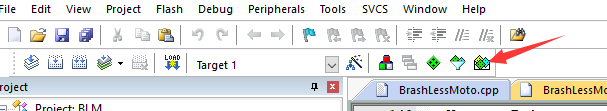
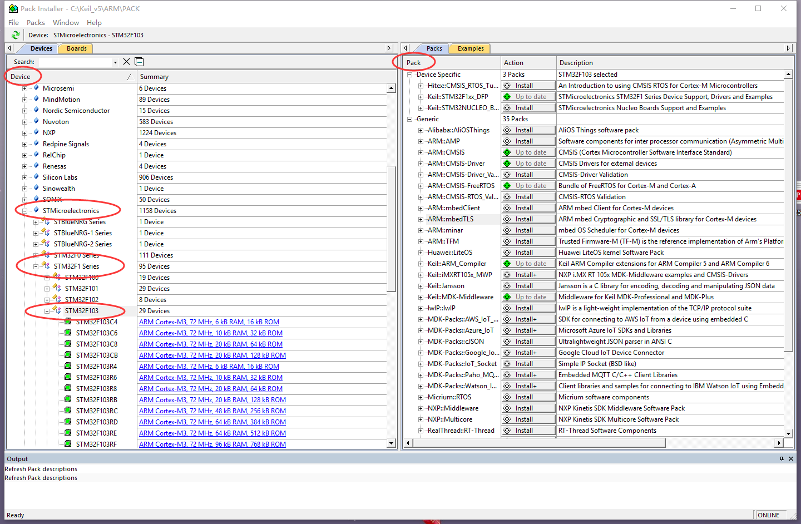

# 打勾勾神教
## 1.打勾勾前的准备
首先确保你使用的是[最新版KEIL  MDK-Arm](http://www.stmcu.org.cn/module/forum/forum.php?mod=viewthread&tid=608664&highlight=MDK "标题")
  
    要使用keil的打勾勾功能，必须先用Pack Installer安装一些必要的东西

    等待界面加载完成后，到Device下面依次找到STMicroelectronics,STM32F1 Series,STM32F103.到这步后，Pack下面会长这样
  

