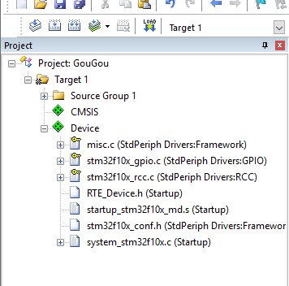
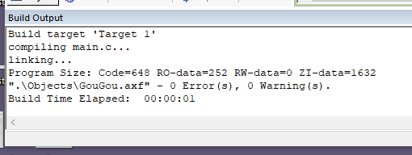

# 打勾勾神教
## 0.注意事项
1. 本教程适于STM32F1xx系列的单片机。
2. 首先确保你使用的是[最新版KEIL  MDK-Arm](http://www.stmcu.org.cn/module/forum/forum.php?mod=viewthread&tid=608664&highlight=MDK "标题")
## 1.打勾勾前的准备
### 安装必要的Pack

    要使用keil的打勾勾功能，必须先用Pack Installer安装一些必要的东西

    等待界面加载完成后，到Device下面依次找到STMicroelectronics,STM32F1 Series,STM32F103.到这步后，Pack下面会长这样
  

        安装这个Pack

     如果想使用Free RTOS操作系统的同学可以安装这个

      最后检查一下有没有其他必要的Pack没有安装，红框部分是必须安装的

## 2.开始打勾勾创建工程

    点击Project,新建一个工程

    展开STMicroelectronics，找到STM32F103,选择你使用的单片机型号

     选择完单片机型号后，就进入打勾勾神教的重点了，首先在CMSIS里的CORE后面打勾。

    再进入Device,在Startup后面打勾。接下来展开StdPeriph Drivers,把Framework勾上，RCC也是必须勾的（这是时钟）,现在重要的东西已经勾完了,你可以根据你的需要勾选你要用到的比如GPIO,USART,TIM等外设（靠近Device的那个DMA和GPIO不要勾，我也不晓得这是什么库）,点击OK确认。

    建完工程后Project下面是这样的，如果你的和我的一样那就说明你已经成功建立了工程 啪~~~啪~~~啪~~~

## 3.开始编写代码

    右键Source Group 1,点击Add New Item to Group 'xxxxx'

    选择C File(.c),名字随便起一个,点击Add向工程中加入一个c文件

    首先引用头文件 stm32f10x.h ,这个头文件里面包含了你勾选了的所有外设的头文件，所以不必再引用 stm32f10x_rcc.h 等头文件。写一个最简单的程序，点击编译。

    0 Error 0 Warning!

